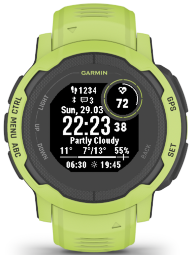

# Nox Info

A custom Garmin Connect IQ watch face for the **Garmin Instinct 2**, built in Monkey C.

---

## Screenshot



| Element | Description | Data Source |
|---------|-------------|-------------|
| 👟 Steps | Daily step count | `ActivityMonitor` |
| ❤ HR ring | Stress level arc (0–100%) | `SensorHistory` |
| HR value | Current heart rate (bpm) | `Activity` |
| Bluetooth | Connected to phone indicator | `System.DeviceSettings` |
| Notifications | Unread notification count | `System.DeviceSettings` |
| Date | Day name + day.month (e.g. Sun, 29.03) | `Time.Gregorian` |
| Time | HH:MM in large font | `System.ClockTime` |
| Seconds | Live seconds counter | `System.ClockTime` (via `onPartialUpdate`) |
| Condition | Weather condition text | `Weather.getCurrentConditions` |
| Temp | Current temperature | `Weather.getCurrentConditions` |
| Low/High | Daily low and high temperature | `Weather.getCurrentConditions` |
| Humidity | Relative humidity % | `Weather.getCurrentConditions` |
| Timeline | 24h bar — night (dotted) / day (solid) | `Weather.getSunrise/getSunset` |
| Now marker | Vertical bar showing current time on timeline | `System.ClockTime` |
| Sunrise | Sunrise time | `Weather.getSunrise` |
| Sunset | Sunset time | `Weather.getSunset` |

---

## Build

**Requirements:**
- Garmin Connect IQ SDK 8.2.1+
- Developer key

```bash
# Build
monkeyc -o bin/NoxInfo.prg -f monkey.jungle -d instinct2 -y <developer_key>

# Watch mode (auto-rebuild + simulator restart on file change)
bash watch.sh
```

**Deploy to device:**
```bash
cp bin/NoxInfo.prg /Volumes/GARMIN/GARMIN/Apps/
```

---

## Manifest

- **App ID:** `7d61624c-cc18-4d21-9a47-e1dbca4b45ff`
- **Target device:** Instinct 2
- **Min API:** 3.2.0
- **Permissions:** Background, Sensor, SensorHistory, UserProfile, Positioning

---

## Support

If you enjoy this watch face, consider buying me a coffee!

[](https://ko-fi.com/oguzy)
